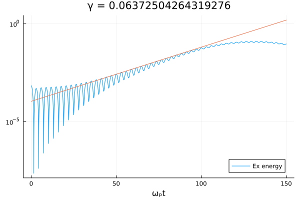
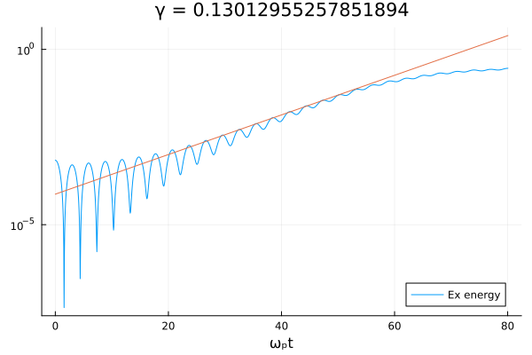
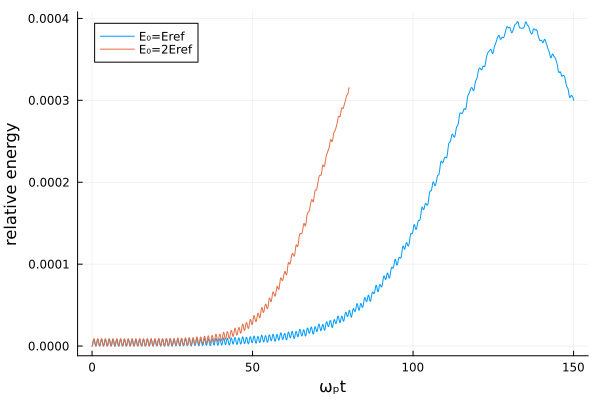

# Stimulated Raman Scattering without spin 


We consider the Vector spin Vlasov-Maxwell laser plasma model with ``{\mathbf f}=0``
and ``{\mathfrak h}=0``. More details in the section *Numerical experiments* in  [crouseilles_hervieux_hong_manfredi_2023](@cite).


```julia
using Plots
using GenericFFT
using ProgressMeter
using VectorSpin
```

```math
\left\{
\begin{aligned}
&\frac{\partial f}{\partial t} + p \frac{\partial f}{\partial x} + [ E_x  - {\mathbf A}_\perp \cdot \frac{\partial {\mathbf A}_\perp}{\partial x} ]\frac{\partial f}{\partial p} = 0,\\
&\frac{\partial E_x}{\partial t} = -\int_{\mathbb{R}} p f  \mathrm{d}{p},\\
&\frac{\partial E_y}{\partial t} = - \frac{\partial^2 A_y}{\partial x^2} + A_y \int_{\mathbb{R}}  f  \mathrm{d}{p},\\
&\frac{\partial E_z}{\partial t} = - \frac{\partial^2 A_z}{\partial x^2} + A_z \int_{\mathbb{R}}  f  \mathrm{d}{p},\\
&\frac{\partial {\mathbf A}_\perp}{\partial t} = - {\mathbf E}_\perp,\\
&\frac{\partial E_x}{\partial x} = \int_{\mathbb{R}} f \mathrm{d}{p} - 1.
\end{aligned}
\right.
```

We consider the periodic condition with spatial period ``L=4\pi/k_e``, also take
``H=5`` for the computational domain in ``v``-direction.

We take the following values for physical parameters:

```julia
alpha = 0.02
ke = 1.2231
vth = 0.17
k0 = 2ke
```

Mathematical domain parameters are taken as ``N_x=129, N_v=129, \Delta t =0.05``

```julia
xmin, xmax, nx = 0.0, 4pi / ke, 129
vmin, vmax, nv = -5.0, 5.0, 129
mesh = Mesh(xmin, xmax, nx, vmin, vmax, nv)
dt = 0.05
```

```math
w_0=2.6428, k_s=k_e
```

```julia
w0 = 2.6428
ks = ke
```

We use a perturbed Maxwellian as an initial condition for ``f``

```math
f(t=0,x,p)=(1+\alpha \cos(k_e x))\frac{1}{\sqrt{2\pi}v_{th}}e^{-\frac{p^2}{2v_{th}^2}},
```
    

```julia
f(x, v) = exp(-0.5 * v^2 / vth^2) * (1 + alpha * cos(ke * x)) / sqrt(2π) / vth
```

and the initial longitudinal electric field

```math
E_x(t=0,x)=(\alpha /k_e)\sin(k_e x). 
```

Here ``\alpha`` and ``k_e`` are the amplitude and the wave number
of the perturbation respectively, and the ``v_{th}`` is the electron
thermal speed. For the transverse fields, we consider an incident
electromagnetic wave with circular polarization:

```math
\begin{aligned}
& E_y(t=0,x)=E_0 \cos(k_0 x), \\
& E_z(t=0,x)=E_0 \sin(k_0 x),\\
& A_y(t=0,x)=-\frac{E_0}{w_0} \sin(k_0 x), \\ 
& A_z(t=0,x)=\frac{E_0}{w_0} \cos(k_0 x),
\end{aligned} 
```

where the ``k_0`` and ``w_0`` are the wave number and the amplitude
of the transverse electric field respectively. 

We also take the amplitude of the incident wave ``E_{ref}=0.325``
as a reference value. 
be in the range ``0.25E_{ref} \leq E_0  \leq 2E_{ref}.``


```julia
function run(final_time, f0, f1, f2, f3, E1, E2, E3, A2, A3)
    
    dt = 0.05 
    nsteps = ceil(Int, final_time / dt + 1)
    k0 = 2.0 * ke
    w0 = sqrt(1.0 + k0^2) # w0
    h_int = 0.0
    
    data = Diagnostics(f0, f2, f3, E1, E2, E3, A2, A3, mesh, h_int)
    
    H2 = H2fhOperator(mesh)
    He = HeOperator(mesh)
    HA = HAOperator(mesh)
    H3 = H3fhOperator(mesh)
    Hp = HpOperator(mesh)
    
    save!(data, 0.0, f0, f2, f3, E1, E2, E3, A2, A3)
    
    @showprogress 1 for i = 1:nsteps 
    
        step!(H2, f0, f1, f2, f3, E3, A3, dt / 2, h_int)
        step!(He, f0, f1, f2, f3, E1, E2, E3, A2, A3, dt / 2)
        step!(HA, f0, f1, f2, f3, E2, E3, A2, A3, dt / 2)
        step!(H3, f0, f1, f2, f3, E2, A2, dt / 2, h_int)
        step!(Hp, f0, f1, f2, f3, E1, dt)
        step!(H3, f0, f1, f2, f3, E2, A2, dt / 2, h_int)
        step!(HA, f0, f1, f2, f3, E2, E3, A2, A3, dt / 2)
        step!(He, f0, f1, f2, f3, E1, E2, E3, A2, A3, dt / 2)
        step!(H2, f0, f1, f2, f3, E3, A3, dt / 2, h_int)
        save!(data, i * dt, f0, f2, f3, E1, E2, E3, A2, A3)
    
    end
    data
end
```

time evolution of the longitudinal electric field norm for `E_0 = E_{ref}`
```math
|| E_x (t)|| =\left(\frac{1}{2}\int_0^L E_x^2(t,x) \mathrm{d}\mathrm{x}\right )^{\frac{1}{2}}
```

```julia
final_time = 150
E0 = 0.325 
E1 = fft(alpha ./ ke .* sin.(ke .* mesh.x))
E2 = fft(E0 .* cos.(k0 .* mesh.x))
E3 = fft(E0 .* sin.(k0 .* mesh.x))
A2 = -fft(E0 ./ w0 .* sin.(k0 .* mesh.x))
A3 = fft(E0 ./ w0 .* cos.(k0 .* mesh.x))
f0 = initialize_distribution(mesh, f)
f1 = zeros(mesh.nx, mesh.nv)
f2 = zeros(mesh.nx, mesh.nv)
f3 = zeros(mesh.nx, mesh.nv)
data1 = run(final_time, f0, f1, f2, f3, E1, E2, E3, A2, A3)
plot(data1.time, data1.Ex_energy, yscale = :log10, label = "Ex energy")
line, γ = fit_complex_frequency(data1.time, data1.Ex_energy)
plot!(data1.time, line, legend = :bottomright, label = :none)
title!("γ = $(imag(γ))")
xlabel!("ωₚt")
```



```julia
final_time = 80
E0 = 0.65 
E1 = fft(alpha ./ ke .* sin.(ke .* mesh.x))
E2 = fft(E0 .* cos.(k0 .* mesh.x))
E3 = fft(E0 .* sin.(k0 .* mesh.x))
A2 = -fft(E0 ./ w0 .* sin.(k0 .* mesh.x))
A3 = fft(E0 ./ w0 .* cos.(k0 .* mesh.x))
f0 = initialize_distribution(mesh, f)
f1 = zeros(mesh.nx, mesh.nv)
f2 = zeros(mesh.nx, mesh.nv)
f3 = zeros(mesh.nx, mesh.nv)
data2 = run(final_time, f0, f1, f2, f3, E1, E2, E3, A2, A3)
plot(data2.time, data2.Ex_energy, yscale = :log10, label = "Ex energy")
line, γ = fit_complex_frequency(data2.time, data2.Ex_energy)
plot!(data2.time, line, legend = :bottomright, label = :none)
title!("γ = $(imag(γ))")
xlabel!("ωₚt")
```




```julia
plot(data1.time, abs.(data1.energy .- first(data1.energy)) ./ first(data1.energy), label="E₀=Eref")
plot!(data2.time, abs.(data2.energy .- first(data2.energy)) ./ first(data2.energy), label="E₀=2Eref")
xlabel!("ωₚt")
ylabel!("relative energy")
```


